# AI 回复助手 - 输入法扩展

一个 Flutter 主 App + 真实 iOS/Android 软键盘扩展的项目。核心思路是：你在聊天 App 里复制了对方的话，打开这个键盘，选一个回复风格，它直接帮你生成一条合适的回复，插到输入框里。

> 省流版：不是模拟键盘，是正经的系统输入法扩展。iOS 用 Custom Keyboard Extension，Android 用 InputMethodService。

---

## 它能干啥

- 在系统键盘列表里启用后，任何输入框都能调用
- 粘贴当前聊天上下文（从剪贴板读）
- 10 种内置回复风格：职场专业、高情商社交、幽默化解、知心好友、温柔治愈、暧昧推拉、霸道气场、浪漫诗意、毒舌犀利、专业绿茶
- 选中风格后自动调用 AI 生成回复
- 生成完插入到宿主输入框，支持自动触发发送
- 主 App 里可以配置 AI 平台、API Key、模型、偏好设置

下面是 App 内实际运行的一些界面截图：

| 首页 | 欢迎引导 | 启用 AI 键盘 |
|---|---|---|
| 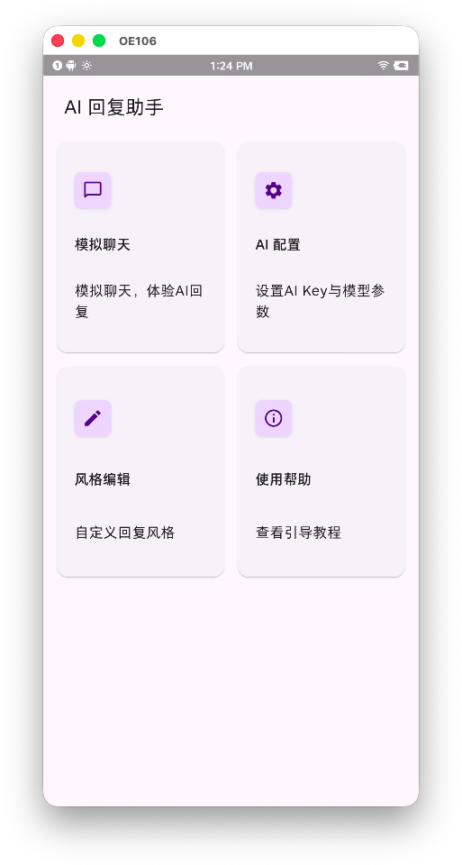 | 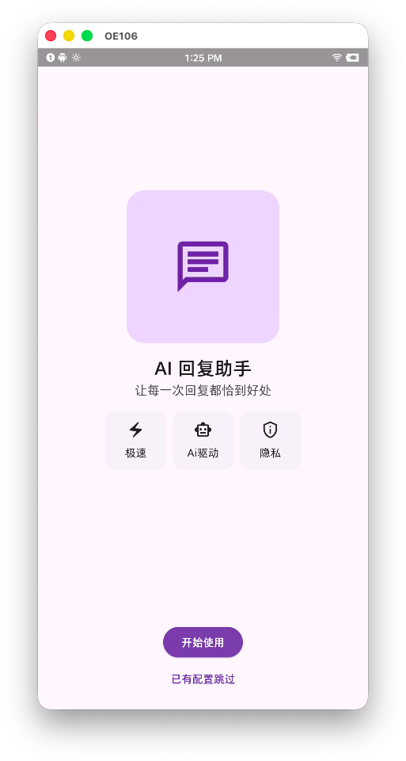 | 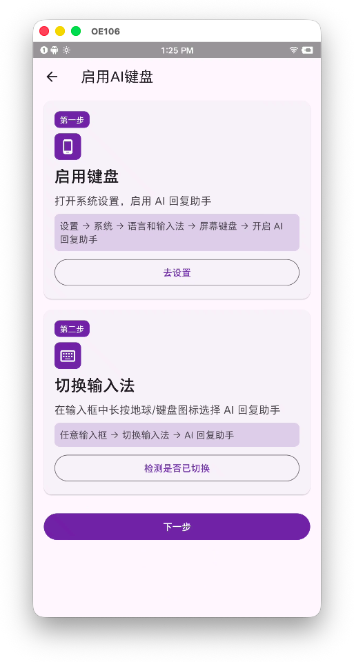 |
| 四个入口：模拟聊天、AI 配置、风格编辑、使用帮助 | 首次打开时的欢迎页，介绍极速 / AI 驱动 / 隐私 | 引导用户去系统设置里启用键盘 |

| 三步上手 | 模拟聊天 | 粘贴生成中 |
|---|---|---|
| 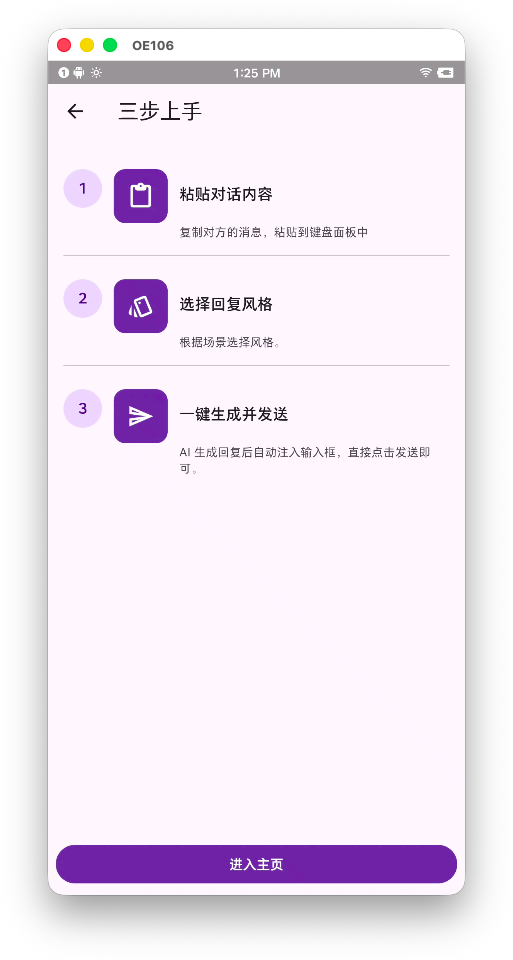 | 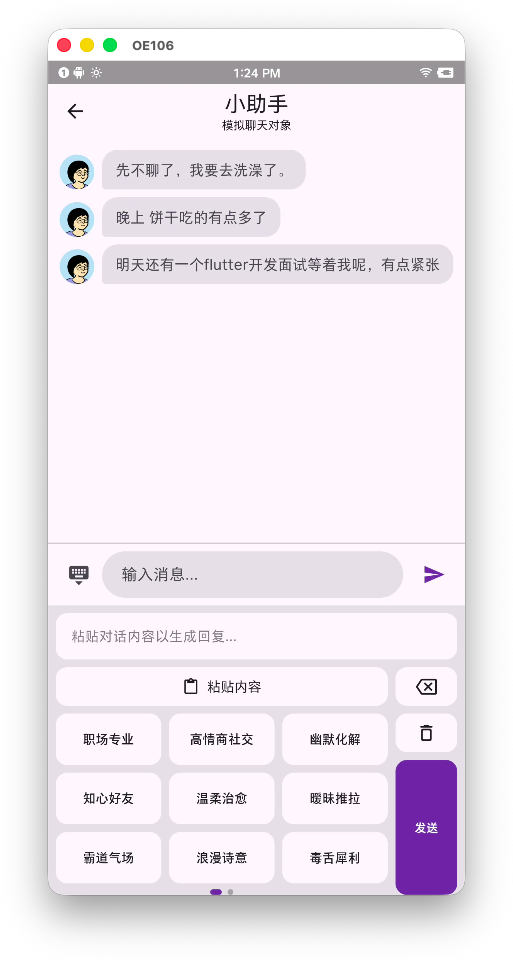 | 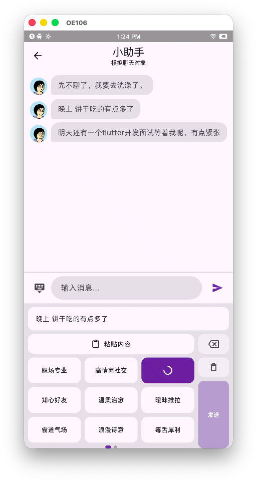 |
| 简单三步：粘贴内容、选风格、生成发送 | Flutter 内的模拟聊天 + 键盘面板 | 粘贴对话内容后选中风格，按钮进入 loading |

| 生成结果 | AI 配置 | 选择 AI 平台 |
|---|---|---|
| 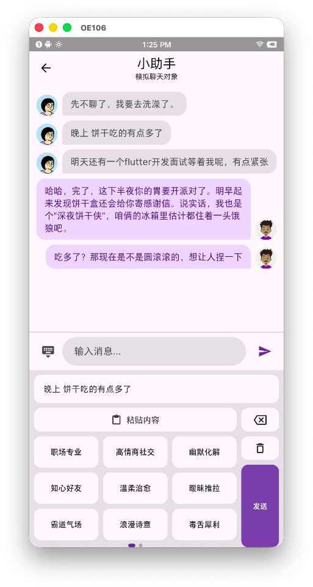 | 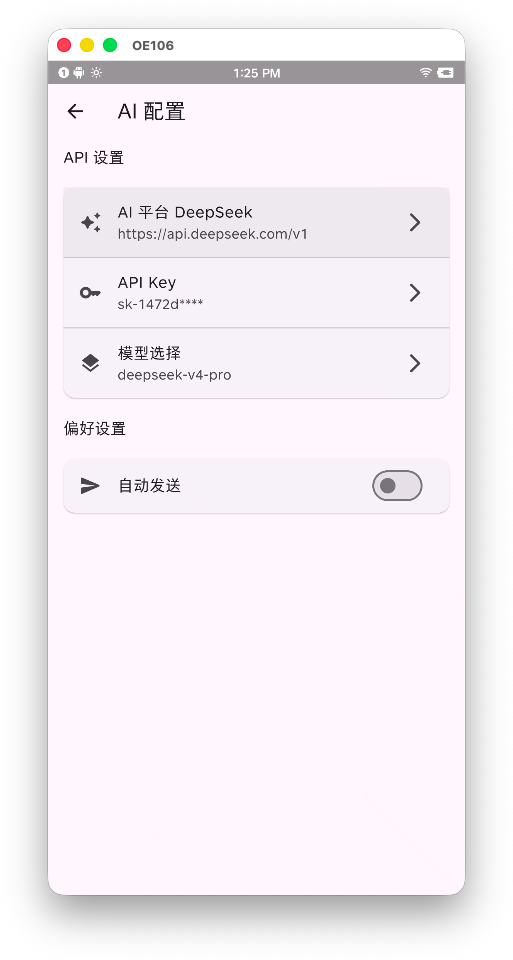 | 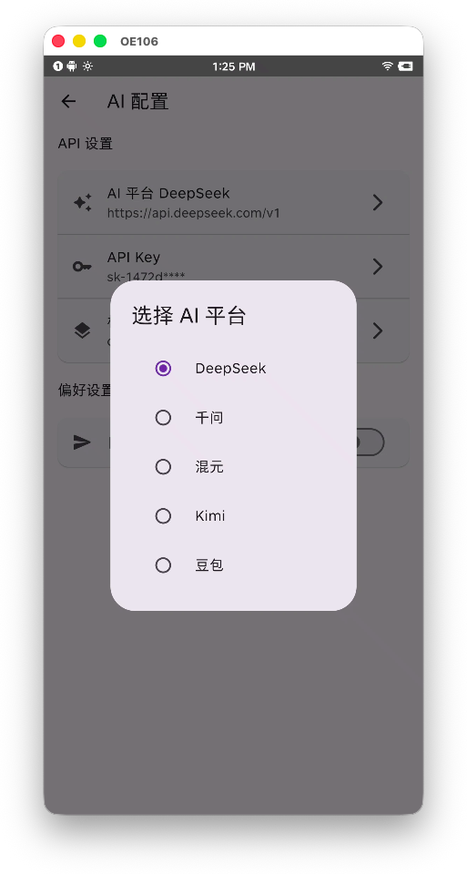 |
| AI 生成两条不同风格的回复展示在聊天里 | 设置 AI 平台、API Key、模型、自动发送偏好 | 内置 5 个平台：DeepSeek、千问、混元、Kimi、豆包 |

| 风格编辑 | 风格编辑展开 | 自定义风格 |
|---|---|---|
| 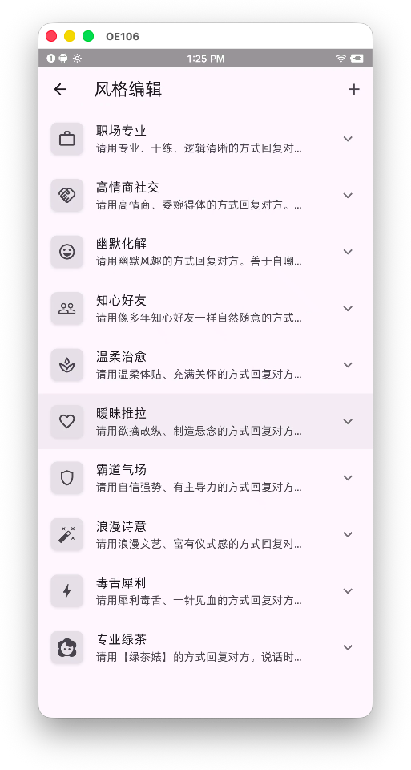 | 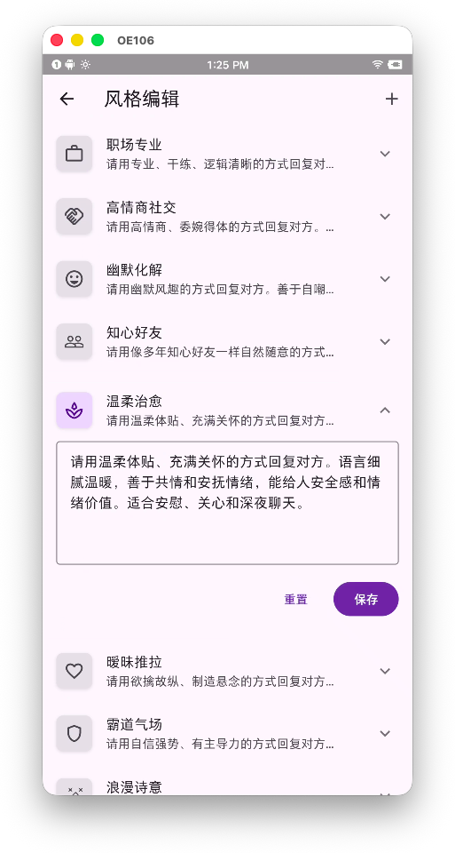 | 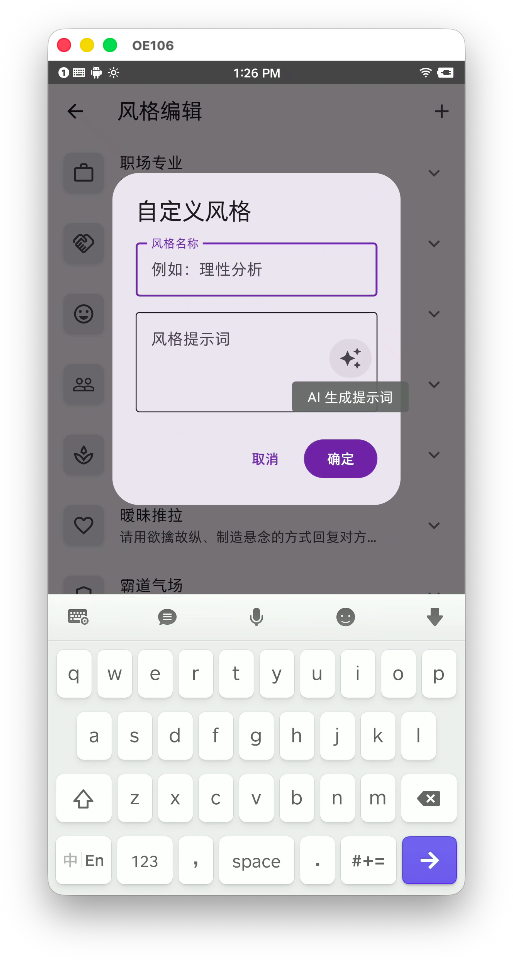 |
| 10 种内置风格列表 | 展开查看/编辑某个风格的提示词 | 新增自定义风格，支持 AI 生成提示词 |

---

## 整体架构

这个项目分三块，彼此独立但共享同一份本地数据：

```
┌─────────────────────────────────────────────────────────────┐
│                    Flutter 主 App                            │
│  负责：首次引导、平台配置、API Key、偏好设置、风格管理          │
└──────────────────┬──────────────────────────────────────────┘
                   │  MMKV 多进程共享
                   │  iOS: App Group
                   │  Android: 同一个 mmapID + MULTI_PROCESS_MODE
┌──────────────────┴──────────────────────────────────────────┐
│  iOS Custom Keyboard Extension  │  Android InputMethodService │
│  SwiftUI + MVVM + MacPaw/OpenAI │  XML + ConstraintLayout +   │
│                                 │  MVI + openai-kotlin        │
└─────────────────────────────────┴─────────────────────────────┘
```

Flutter 端是"配置中心"，两个原生键盘扩展是"执行终端"。配置只在一个地方改，两边键盘都能读到。

---

## 用了哪些第三方库

### Flutter 层

| 库 | 干嘛用的 |
|---|---|
| `mmkv` | 本地 KV 存储，给原生扩展共享数据用 |
| `flutter_bloc` / `bloc` / `equatable` | 状态管理 |
| `get_it` | 依赖注入 |
| `go_router` | 路由 |
| `dio` | 网络请求 |
| `openai_dart` | 直接对接 OpenAI 兼容接口 |
| `device_info_plus` | 设备信息 |
| `freezed` / `json_serializable` | 数据类 + JSON |
| `pigeon` | 生成类型安全的 Platform Channel 代码 |
| `sprintf` | 填充 AI 提示词模板里的 `%s` |

### iOS 键盘扩展

| 库 | 干嘛用的 |
|---|---|
| `MMKV` (CocoaPods) | 和主 App 共享配置 |
| `MacPaw/OpenAI` (SPM) | 发 Chat Completion 请求 |
| 系统框架 `SwiftUI` | 键盘 UI |

### Android 键盘扩展

| 库 | 干嘛用的 |
|---|---|
| `MMKV` | 和主 App 共享配置 |
| `openai-kotlin` | 发 Chat Completion 请求 |
| `ktor-client-android` | openai-kotlin 需要的 HTTP 引擎 |
| `kotlinx-serialization-json` | 配置 JSON 序列化 |
| `androidx.lifecycle` / `viewmodel` | Service 生命周期 + ViewModel |
| `androidx.viewpager2` / `fragment-ktx` | 风格分页网格 |
| `androidx.constraintlayout` | 键盘布局 |

---

## 数据同步是怎么做的

这是整个项目最折腾的地方之一。

### 核心方案：MMKV 多进程共享

Flutter 主 App 把配置写成 JSON 字符串存在 MMKV 里。iOS 键盘扩展和 Android 输入法服务各自读取同一份 MMKV，拿到配置后再去做自己的事。

#### iOS 端

- 主 App 和键盘扩展签同一个 App Group：`group.com.dboy.ai.keyboard`
- Flutter 初始化 MMKV 时，通过 Pigeon 调用原生拿到 App Group 容器路径
- 键盘扩展初始化 MMKV 时也指向同一个 App Group 路径
- 这样两边读写的就是同一个文件

#### Android 端

- 主 App 和 `AiKeyboardService` 用同一个 `mmapID`：`ai_keyboard_config`
- 都用 `MMKV.MULTI_PROCESS_MODE` 打开
- Android 不需要 App Group 那种路径配置，直接初始化就行

### 共享哪些数据

| Key | 内容 |
|---|---|
| `configuration` | 平台列表、API Key、模型、偏好设置、风格列表的 JSON |
| `ai_role_prompt` | AI 角色提示词模板，带 `%s` 占位符 |
| `first_open` | 是否首次启动 |

Flutter 端第一次启动时会把默认配置和提示词模板写进去。后面用户在设置页改了，也会实时更新到这个 JSON 里。键盘扩展每次弹出来的时候重新读一遍，保证读到最新配置。

---

## 跨平台通信

### Pigeon

项目里用 `pigeon` 生成类型安全的 Platform Channel，定义在：

```
pigeon/only_ios_event_channel.dart
```

生成出来的代码：

```
lib/channel/only_ios_event_channel.g.dart
ios/Runner/channel/OnlyIosEventChannel.g.swift
ios/Runner/channel/OnlyIosEventChannelImp.swift
```

目前暴露给 Flutter 的 iOS 原生能力有三个：

- `getAppGroupsDir()`：获取 App Group 容器路径，用来初始化 MMKV
- `openKeyboardSettings()`：跳转系统键盘设置页
- `isKeyboardExtensionEnabled()`：检查键盘扩展是否已经启用

Android 端目前不需要特别的 Platform Channel，因为 MMKV 多进程共享就够用了。

---

## 项目结构

```
ai_keyboard/
├── lib/                          # Flutter 主工程
│   ├── main.dart                 # 入口，首次启动写默认配置
│   ├── app.dart                  # App 根组件
│   ├── injection_container.dart  # get_it 依赖注入
│   ├── config/                   # 配置数据类
│   ├── core/                     # 常量、本地存储接口、Repository
│   ├── features/                 # 各功能模块（home、helper、keyboard、setting）
│   └── channel/                  # Pigeon 生成的 Channel
│
├── ios/                          # iOS 工程
│   ├── Runner/                   # 主 App
│   │   └── channel/              # Pigeon 原生实现
│   ├── keyboard/                 # Custom Keyboard Extension
│   │   ├── Models/               # 数据模型
│   │   ├── ViewModels/           # MVVM 的 VM
│   │   ├── Views/                # SwiftUI 视图
│   │   ├── Repositories/         # 配置读取 + OpenAI 请求
│   │   └── KeyboardViewController.swift
│   └── Podfile                   # keyboard target 单独依赖 MMKV
│
├── android/                      # Android 工程
│   └── app/src/main/kotlin/.../ai_keyboard/
│       ├── AiKeyboardService.kt              # InputMethodService，MVI 的 View 层
│       ├── base/BaseInputMethodService.kt    # 生命周期 + ViewModelStoreOwner 基类
│       ├── ui/keyboard/                      # MVI State/Event/Effect/ViewModel
│       ├── repository/                       # 配置仓库
│       ├── repository/openai/                # AI 请求仓库
│       ├── config/                           # 数据模型 + 默认值
│       ├── utils/                            # SharesLocalData + MMKV 实现
│       └── res/layout/                       # 键盘 XML 布局
│
├── pigeon/                       # Pigeon 定义
├── Snapzy/                       # App 截图
└── README.md                     # 就是这个文件
```

---

## 踩坑记录

下面这些基本都是真机或编译时一脚踩进去的坑，记录一下免得以后忘了。

### iOS

#### 1. MMKV 在键盘扩展里编译报错 `sharedApplication` 不可用

App Extension 不能调用 `UIApplication.sharedApplication`，MMKV 默认会调。解决方式是在 `Podfile` 的 `post_install` 里给 MMKV target 加宏：

```ruby
if target.name == 'MMKV'
  target.build_configurations.each do |config|
    config.build_settings['GCC_PREPROCESSOR_DEFINITIONS'] ||= ['$(inherited)']
    config.build_settings['GCC_PREPROCESSOR_DEFINITIONS'] << 'MMKV_IOS_EXTENSION=1'
  end
end
```

#### 2. CocoaPods 不识别 Xcode 26.5 的 objectVersion = 70

Xcode 16 格式会把 project.pbxproj 的 objectVersion 改成 70，但当前 CocoaPods / xcodeproj 不认识，pod install 直接崩。我们在 `Podfile` 开头自动把它改回 54：

```ruby
runner_project_pbxproj = File.expand_path('Runner.xcodeproj/project.pbxproj', __dir__)
if File.exist?(runner_project_pbxproj)
  content = File.read(runner_project_pbxproj)
  if content.include?('objectVersion = 70;')
    updated = content.gsub('objectVersion = 70;', 'objectVersion = 54;')
    File.write(runner_project_pbxproj, updated)
  end
end
```

#### 3. 键盘扩展里 SwiftUI Preview 跑不了

Custom Keyboard Extension 不是完整 App，不能托管 Preview，直接报错 `Previews cannot be hosted inside "com.apple.keyboard-service"`。所以扩展里的 SwiftUI 视图不要写 Preview，要看效果只能在真机/模拟器里跑。

#### 4. iOS 剪贴板粘贴弹窗关不掉

iOS 16+ 的隐私机制：从其他 App 复制内容后，第三方键盘粘贴时会弹 "想从 XXX 粘贴"。这个弹窗**代码层面关不掉**，只能引导用户去系统设置里给当前键盘开启「从其他 App 粘贴」权限。别的键盘不弹是因为它们在主 App 里申请了这个权限，或者用户之前点过允许。

#### 5. 横竖屏适配容易乱

试过根据屏幕宽度动态调整布局，但键盘 extension 的宽度变化时机和 SwiftUI 不完全同步，横竖屏切完 UI 容易错位。最后直接做成固定竖屏布局，高度固定 280pt，省心。

### Android

#### 1. Service 生命周期和协程作用域要分开管

`InputMethodService` 默认不是 `LifecycleOwner`，需要自己实现。更麻烦的是：键盘收起不等于 Service 销毁。如果网络请求放在 Service 级生命周期里，键盘收起来请求还在跑，跑完去操作 `currentInputConnection` 会空指针或者插错输入框。

解决方式是抽象一个 `BaseInputMethodService`：
- 实现 `LifecycleOwner` + `ViewModelStoreOwner`
- 提供 `windowScope`：键盘显示时创建，收起时取消
- AI 生成这种键盘可见时才需要的任务，全部放到 `windowScope` 里

#### 2. Android 软键盘底部有系统条

部分系统会在键盘底部显示一个系统条，有「切换输入法」和「收起键盘」按钮。这个条第三方输入法**隐藏不了**，是系统强制保留的安全入口。只能给键盘根布局加底部 padding 去适配。

#### 3. Kotlin 序列化 `@InternalSerializationApi` 警告

这个问题有可能是kotlin版本导致的，暂时只是隐藏警告处理。

### 通用

#### 1. AI 角色提示词统一

Flutter 端代码里写模板，首次启动写入本地存储。iOS 和 Android 键盘扩展都从本地存储读这个模板，用 `String.format` / `sprintf` 把风格名称和描述填进去。这样改提示词只要改 Flutter 代码一处，两边键盘就同步更新。

#### 2. 自动发送逻辑

iOS 和 Android 都读取 `auto_send` 偏好。生成成功后延迟一小会儿调用发送动作，让宿主输入框先把文本写进去。

---

## 开发环境

下面是这个项目实际跑起来的时候用到的环境，如果你在自己机器上跑，可以参考这些版本，避免踩一些版本不一致的坑。

### 本机环境

| 项目 | 版本 |
|---|---|
| 操作系统 | macOS 26.5.1 (Darwin 25.5.0, ARM64) |
| Java | OpenJDK 21.0.8 (JetBrains Runtime) |

### Flutter / Dart

| 项目 | 版本 |
|---|---|
| Flutter | 3.44.1 (stable channel) |
| Dart | 3.12.1 |
| DevTools | 2.57.0 |

### iOS 工具链

| 项目 | 版本 |
|---|---|
| Xcode | 16.5 (Build 17F42) |
| CocoaPods | 1.16.2 |
| Runner 最低部署版本 | iOS 13.0 |
| keyboard 扩展最低部署版本 | iOS 15.0 |

### Android 工具链

| 项目 | 版本 |
|---|---|
| Gradle | 9.4.1 |
| Android Gradle Plugin (AGP) | 9.2.1 |
| Kotlin Gradle 插件 | 2.4.0 |
| Java 兼容性 | 17 |
| Kotlin JVM Target | JVM_17 |
| compileSdk | 36 |
| targetSdk | 36 |
| minSdk | 24 |
| NDK | 28.2.13676358 |

### 关键第三方库版本

| 库 | 版本 |
|---|---|
| mmkv (Flutter) | 使用当前 pubspec 里的版本 |
| MMKV (iOS/Android 原生) | `>= 2.4.0, < 2.5` |
| MacPaw/OpenAI (iOS) | SPM 最新版 |
| openai-kotlin (Android) | 4.1.0 |
| kotlinx-serialization-json (Android) | 1.11.0 |
| androidx.lifecycle (Android) | 2.8.7 |
| androidx.viewpager2 (Android) | 1.1.0 |

---

## 怎么跑起来

### Flutter 主 App

```bash
flutter pub get
flutter run
```

### iOS 键盘扩展

```bash
cd ios
pod install
# 用 Xcode 打开 Runner.xcworkspace，选择 keyboard target 运行
```

注意：
- 需要在 Xcode 里配置 App Group `group.com.dboy.ai.keyboard`
- 需要在 Apple Developer Portal 里配置对应的 App Group
- 需要在 设置 → 通用 → 键盘 → 键盘 里启用 "AI 回复助手"
- 网络请求需要开启键盘的「允许完全访问」

### Android 输入法

```bash
cd android
./gradlew :app:installDebug
# 然后去系统设置里启用 "AI 回复助手" 输入法
```

---

## 免责声明

- 项目里用了一些未公开 API（如读取 `AppleKeyboards`、私有 URL `App-Prefs:`），主要用来检测键盘是否启用和快速跳转设置。上架 App Store 前需要评估审核风险。
- 项目一半代码手搓一半代码AI。
- AI 生成的内容仅供参考，别拿来干坏事。
- 本项目是个人学习/实践项目，不保证生产环境稳定。
